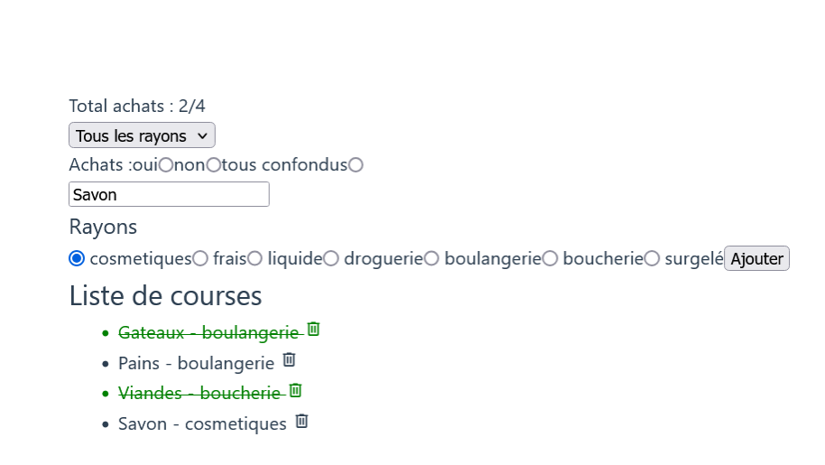

# Exercice 5 : liste de courses


## Recommandations

- Travaillez directement sur le fichier `src/components/HelloWorld.vue` du projet conçu avec `npm init` ou `npm create` en remplaçant le contenu de ce fichier par le code ci-après

```js
<script setup></script>

<template>
  <div class="greetings"></div>
</template>

<style scoped>
h1 {
  font-weight: 500;
  font-size: 2.6rem;
  position: relative;
  top: -10px;
}
h3 { font-size: 1.2rem; }
.greetings h1,
.greetings h3 {
  text-align: center;
}
@media (min-width: 1024px) {
  .greetings h1,
  .greetings h3 {
    text-align: left;
  }
}
</style>

```

## Enoncé

1. Créez une liste de course dont un article possède les propriétés suivantes nom, rayon et acheté
- Ajoutez un champ dédié à la saisie d'une tâche
- Ajoutez des boutons radios pour choisir le rayon associé à l'article
- Ajoutez un événement au clic sur le nom de l'article afin de modifier sa propriété achetée
- Affichez le nombre total des articles achetés par rapport au total de tous les articles par exemple 4/10
- A partir d'un filtre, affichez uniquement les articles achetés
- A partir d'un filtre, affichez uniquement les  articles à acheter
- A partir d'un filtre, affichez tous les articles (à acheter et achetés)
- A partir d'un filtre, affichez les articles par rayon

## Illustration non contractuelle d'une présentation de l'application shoplist

